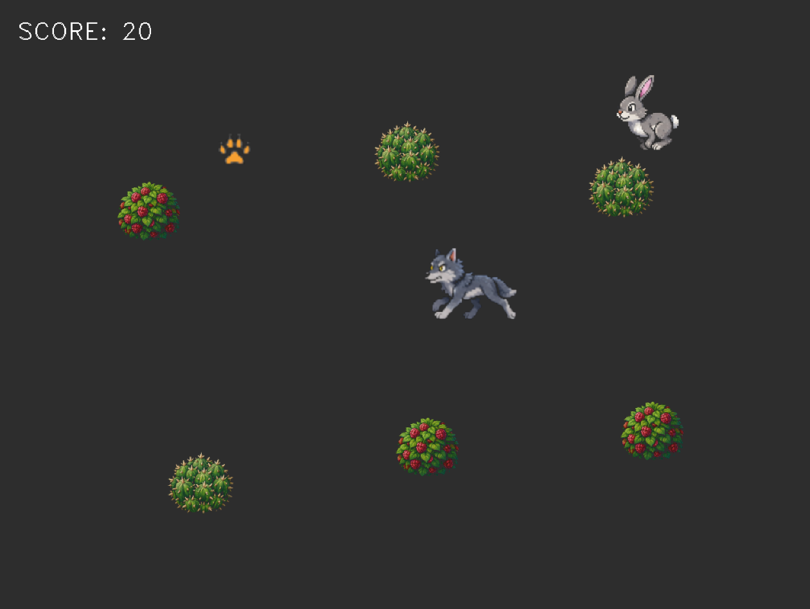

# IR Wolf 🐺🎯🐇

An interactive, retro-styled 2D arcade game built in pure **C++17** and **OpenCV 4**, featuring hardware-level contactless control via an **Infrared (IR) laptop camera** or any external IR sensor using a standard TV remote controller.

The project demonstrates real-time computer vision processing, dynamic difficulty scaling, and custom procedural geometry mapping.



---

## 🚀 Key Features

* **Radial (Polar) IR Coordinate Mapping:** Harnesses the Pythagoras theorem to calculate the exact vector from the camera's center to the IR flash point. This provides smooth, symmetrical diagonal movements.
* **Smart Escape & Clamping AI (Hare):** The prey continuously calculates the threat vector from the player (IR Wolf). It flees with a 1.5x speed boost, executes trigonometric bank-shots (angle of incidence equals angle of reflection) upon hitting a custom bounding ellipse, and dashes through the Wolf on a 2x turbo speed if trapped in corners.
* **Procedural Forest Generation:** Every 3 scored points, the `MapManager` dynamically spawns a new pixel-art tree. It features a strict *Clearance Checking* algorithm—ensuring trees never form soft-locks and always leave a path wider than the Wolf's collision radius.
* **Interactive 4-Axis Live Calibration:** Includes real-time sliders to calibrate the IR sensor threshold, radial multiplication, dynamic hitbox visualization (red rings), and bounding ellipse resizing.
* **Persistent Settings System:** Automatically reads from and serializes current calibrations to `data/config.txt` upon clean exit (`ESC`), including dynamic Linux device paths (e.g., `/dev/video2`).

---

## 🛠️ Architecture Breakdown

The project follows clean Object-Oriented Programming (OOP) principles and is split into modular components:

* `main.cpp`: Orchestrates the FFMPEG/V4L2 camera capture loop, raw pixel thresholding, OpenCV contour moments calculation, and Z-layer rendering.
* `wolf.cpp / .h`: Controls player movement using target-destination vectors, momentum interpolation (LERP), and state-machine sprite animations.
* `rabbit.cpp / .h`: Implements autonomous flee steering behaviors and non-linear boundary bounding.
* `map_manager.cpp / .h`: Manages procedural generation grids and clearance verification metrics.
* `common.h`: Contains cross-module utilities, macros, and alpha-blending pixel math (`drawSprite`).

---

## 📦 Prerequisites & Dependencies

To compile and run this project under Debian 13 / Ubuntu, install the standard development tools and OpenCV headers:

```bash
sudo apt update
sudo apt install build-essential cmake libopencv-dev pkg-config
```

---

## 🔨 Compilation & Installation

The build pipeline is automated via CMake and handles asset deployment out of the box.

1. Clone the repository and navigate to the root directory.
2. Create your asset pipeline structure and place your pixel-art PNG files inside the `data/` folder:
   * Characters: `wolf_sit.png`, `wolf_run1-4.png`, `hare1-4.png`, `wolf_claw.png`
   * Environment: `tree1-3.png`, `config.txt`

3. Compile the project using the native compiler workflow:
   ```bash
   mkdir build && cd build
   cmake ..
   make
   ```

4. Launch the binary payload:
   ```bash
   ./ir_game
   ```

---

## 🕹️ Calibration Guide

When launching for the first time, change the **Show HUD** slider to **1**. This unlocks the debugging overlay:
1. **IR Threshold:** Slide it to mask out ambient daytime sun noise until the debug feed is purely black.
2. **Radial Multiplier:** Controls the kinetic scale. Increasing it means minor physical remote hand deflections will instantly push the Wolf's claw cursor to the farthest corners of the UI.
3. **Hitbox Radius:** Sets the pixel accuracy needed for a successful capture. 
4. **HUD Switching:** Setting the slider back to **0** hides the overlay matrix and switches the crosshair into a custom pixel-art wolf paw.

---

## 📄 License
This project is open-source and distributed under the MIT License.
